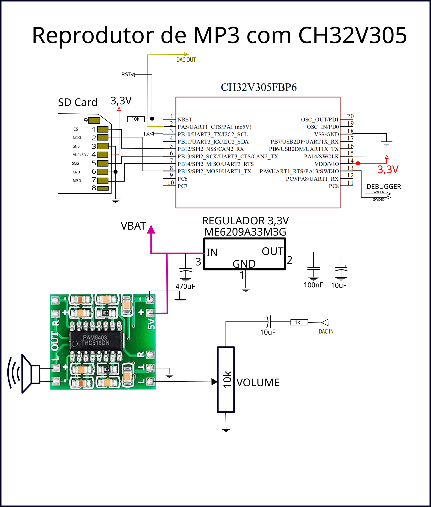
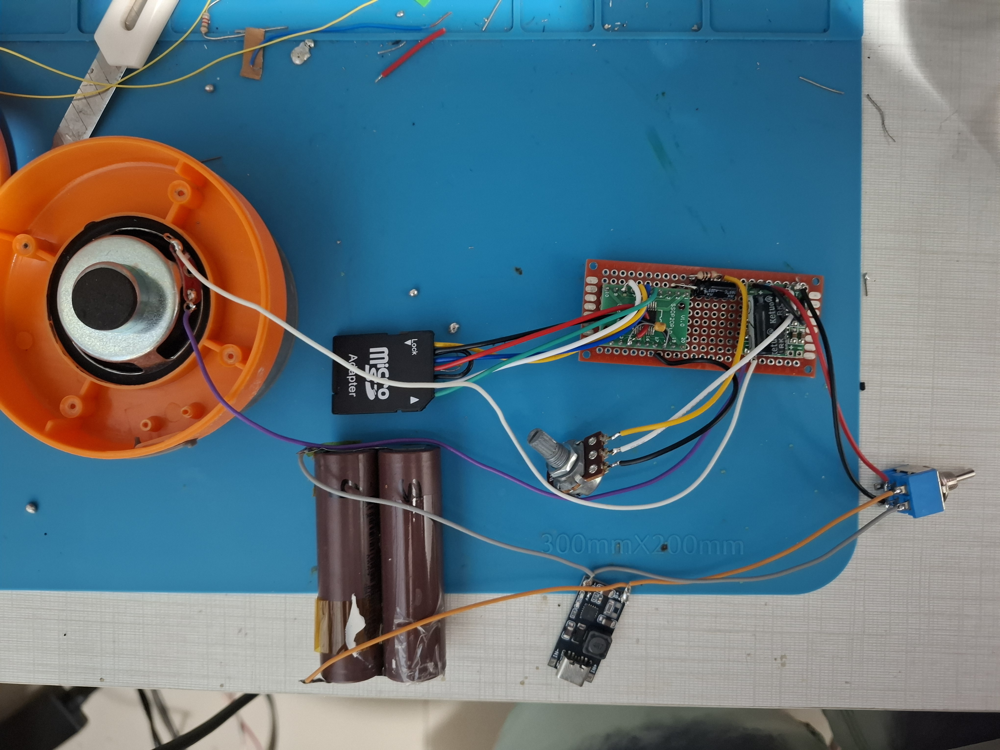

# Decodificação de arquivo MP3 com CH32V30X

Decodificação de MP3 usando [CH32V305](https://www.wch-ic.com/products/CH32V307.html)

 - Usa flash externa W25Q64 com arquivo mp3, execução em loop
- Usa cartão SD de 8GB, executa todos arquivos com extensão MP3 presentes no cartão.

Saída de audio mono, usando DAC de 12 bits do CH32V305FBP6.

Para decodificação do MP3 foi utilizada biblioteca [minimp3] (https://github.com/lieff/minimp3) para ler e listar arquivos do cartão SD foi utilizada biblioteca [Petit FAT File System Module] (https://elm-chan.org/fsw/ff/00index_p.html)

Para programação e criação do firmware foi utilizado a IDE [Mounriver Studio](https://www.mounriver.com/) disponibiliozada pelo fabricante [WCH](https://www.wch-ic.com/). A decodificação de MP3 só é possivel devido a FPU presente no microcontrolador, pois a biblioteca minimp3 trbalha com operações emponto flutuante e é destinada para aplicações em PC.

## Diagrama de montagem

## Testes

